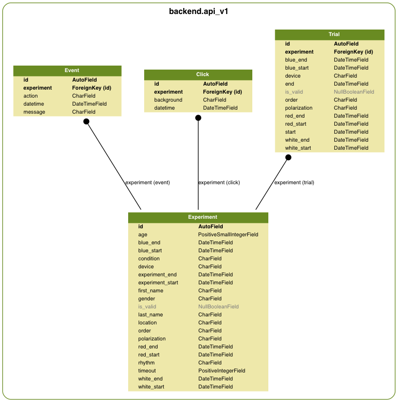

API Documentation
=================

API Usage
---------

.. code-block:: sh

    curl -X $METHOD http://time.astrotech.io/api/3/

Where $METHOD is one of following:

======= ====================================================
METHOD  Action
======= ====================================================
POST    Create new trial from POST data (see below)
OPTIONS Check whether application accepts incoming requests
GET     Get calculated results
======= ====================================================

POST input data format
----------------------

.. code-block:: json

    {
      "trial":{
        "timeout": "60.0",
        "device": "lcd",
        "location": "internet",
        "regularity": "5",
        "colors": ["red", "white", "blue"],
        "start_datetime": "2017-02-24T04:38:04.290Z",
        "end_datetime": "2017-02-24T04:38:30.021Z",
        "uid": "test@example.com"
        "survey_age": "29",
        "survey_condition": "normal",
        "survey_gender": "male",
        "survey_time": "after-sleep",
        "survey_temperature": "36.6",
        "survey_bp_systolic": "120",
        "survey_bp_diastolic": "80",
        "survey_heart_rate": "60",
        "survey_sleep": "08:30",
      },
      "clicks":[
        {"datetime":"2017-02-24T04:38:18.233Z", "color":"red"},
        {"datetime":"2017-02-24T04:38:18.849Z", "color":"red"},
        {"datetime":"2017-02-24T04:38:19.805Z", "color":"red"},
        {"datetime":"2017-02-24T04:38:22.482Z", "color":"white"},
        {"datetime":"2017-02-24T04:38:23.549Z", "color":"white"},
        {"datetime":"2017-02-24T04:38:24.795Z", "color":"white"},
        {"datetime":"2017-02-24T04:38:26.981Z", "color":"blue"},
        {"datetime":"2017-02-24T04:38:28.161Z", "color":"blue"},
        {"datetime":"2017-02-24T04:38:29.325Z", "color":"blue"}]
    }

Output data description
-----------------------
=================  ==============================================
Parameter          Description
=================  ==============================================
uid                Unique Participant ID - Email
age                Participant Age
condition          Participant Condition
gender             Participant Gender
rhythm             Participant Rhythm
\
start_datetime     Start Datetime
end_datetime       End Datetime
location           Where experiment was conducted (eg. internet)
device             Device
polarization       Polarization
timeout            Timeout
regularity         Regularity
\
count_all          Count clicks - all
count_blue         Count clicks - blue
count_red          Count clicks - red
count_white        Count clicks - white
\
tempo_all          Tempo - all
tempo_blue         Tempo - blue
tempo_red          Tempo - red
tempo_white        Tempo - white
\
regularity_all     Regularity - all
regularity_blue    Regularity - blue
regularity_red     Regularity - red
regularity_white   Regularity - white
\
interval_all       Interval - all
interval_blue      Interval - blue
interval_red       Interval - red
interval_white     Interval - white
=================  ==============================================

Internal Backend Architecture
-----------------------------

.. figure:: img/architecture-system.png
    :scale: 50%
    :align: center

    Application architecture overview.

.. figure:: img/architecture-api-v2.png
    :scale: 50%
    :align: center

    Application architecture for ``backend.api_v2``.

    Application architecture for ``backend.api_v1``.

.. note:: How to generate those diagrams?

    .. code:: sh

        python manage.py graph_models -a -g -o docs/img/architecture-system.png
        python manage.py graph_models api_v1 -g -o docs/img/architecture-api-v1.png
        python manage.py graph_models api_v2 -g -o docs/img/architecture-api-v2.png
