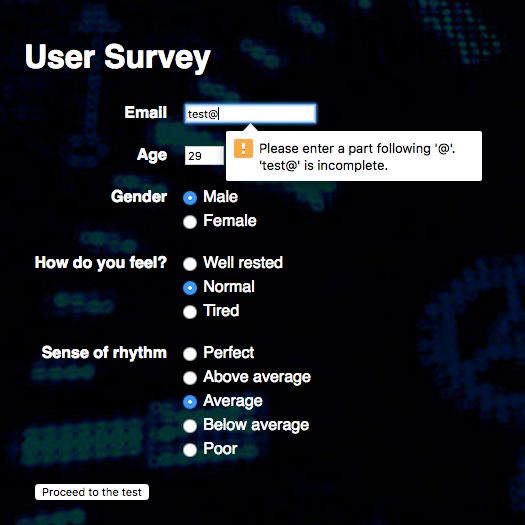
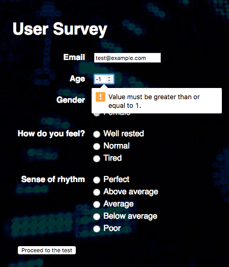
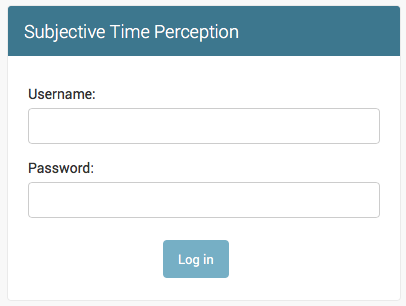
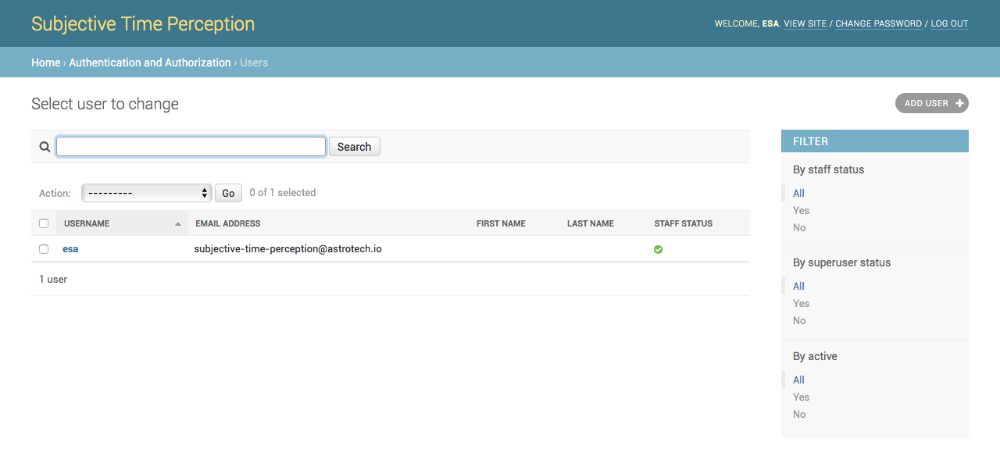

Technology and Architecture
===========================

`Subjective Time Perception Analyzer` (`STPA`) is written as a web application platform. It uses frontend/backend model. Frontend is written in JavaScript with `jQuery` library to handle AJAX requests. Backend is written in `Python` using `Django` framework. Application was meant to be used both online and offline.

    Application architecture overview.

    Subjective Time Perception Analyzer UML activity diagram.

Frontend
--------
Application was meant to be executed on public events like open days or conferences and therefore this requirement has strong impact on application architecture. Frontend part runs locally on guest web browser henceforth it could be run simultaneously on unlimited number of devices. The requirement of being able to run offline and afterwards collect and combine the data shaped the application.

Frontend part of the application allows user for fill survey and measure clicks on the screen while displaying colors. After the experiment data is uploaded to remote server.

Survey invalid input
^^^^^^^^^^^^^^^^^^^^
Application validates user input to the survey. This functionality was implemented using `HTML5` input type validation. Modern web browsers which are required to run this software supports this feature.

    Invalid email address validation.

    Error shown while ``Age`` input field is empty.

    Error displayed while ``Age`` has to low value.

    Error displayed while ``Age`` has to high value.

Random color algorithm
^^^^^^^^^^^^^^^^^^^^^^
Frontend application randomize experiment color order. We've decided to use `Fisher-Yates (aka Knuth) Shuffle` algorithm because it provides unbiased shuffle results [Knu69]_ [FY48]_. It generates random permutation of a finite set and produces an unbiased permutation: every permutation is equally likely.

.. code-block:: javascript

    function shuffle(array) {
        var currentIndex = array.length, temporaryValue, randomIndex;
        while (0 !== currentIndex) {
          randomIndex = Math.floor(Math.random() * currentIndex);
          currentIndex -= 1;
          temporaryValue = array[currentIndex];
          array[currentIndex] = array[randomIndex];
          array[randomIndex] = temporaryValue;
        }
        return array;
    }

Click count validation
^^^^^^^^^^^^^^^^^^^^^^
Application validates user input based on click count per color. Currently supported mode checks whether each color has been clicked at least 5 times. This prevents from conducting an experiment and uploading invalid data. In future version we're planning to implement new experiment generation and configuration procedure hence it will validate data based on those values.

    Application alert when user conduct invalid experiment because of insufficient click count.

Database synchronization mechanism
^^^^^^^^^^^^^^^^^^^^^^^^^^^^^^^^^^
Application is working by default in online mode. After the experiment results are stored in database and synchronized with the remote server.

Although this approach is not possible when experiment is being conducted in remote locations with no internet access. In that case application starts in offline mode and allow user to run the experiment on the local device.

Results are stored in web-browser ``localStorage``. Each time when application is on the main screen or after the experiment it makes the ``HEAD /api/v2/ HTTP/1.1`` request to the server to check whether server responds and is available for receiving results. If server is accepting results then the results will be pushed and upon successful synchronization the ``localStorage`` cache will be cleared.

In case of device being permanently unable to connect to the internet application allows to fetch the cache data by accessing ``/cache.html`` address. Displayed content is a JSON representation of ``localStorage`` data collected by application and not yet uploaded to the remote database.

The application is also immune to uploading the same results once again (eg. in case of connecting device to the internet, from which cache was manually copied before). It will not double the results in database on synchronization but clear the local computer cache.

Debugging mode
^^^^^^^^^^^^^^
Frontend application lets you to use debug mode. Special flag placed on top of the ``frontend/_common.js`` file can be set to ``DEBUG = true``. In such case Trial data will not be write to ``localStorage`` and will not be synchronized with remote database. This will let you to conduct experiments to test whether new business logic is working properly.

    Application alert warning that DEBUG is true.

Backend
-------
Backend layer is responsible for processing data and calculations. It provides users with easy to use administration panel with search capability. As per each request to the backend is logged for safety reasons and for further analysis with different parameters the administration panel is bundled with request logging viewer.

    Application architecture for ``backend.api_v2``.

Technology
^^^^^^^^^^
We have decided to use `Python` language with `Django` framework. This solution provide easy to develop and further extension web applications. As of we're planning to run the experiment at global internet scale the choice for application which does not require installation was obvious. Moreover we will be targeting for different platforms such as tablets, `PC`, `Mac`, smartphones and some custom made setup with LED lamp equipped blindfold.

`Django` framework provides out-of-the-box generation of administration panel with secure authentication, user and groups management together with permissions and access control. Each element has it change history which gives us possibility to experiment with data and rollback modifications.

    Administration panel listing of Trials with search, filter, validate/invalidate and recalculate actions.

Login and user management
^^^^^^^^^^^^^^^^^^^^^^^^^
Application supports login mechanism together with user and group management.

    Application login screen.

    Application login screen after trying with empty fields.

    Application login screen after trying with invalid credentials.

    Application group permission edit screen.

    Application user listing screen.

    Application user edit screen.

Data import and export
^^^^^^^^^^^^^^^^^^^^^^

    Application data export screen with list of formats available to download.

Application backend allows researchers to import and export data in various formats such as: ``.xlsx``, ``.csv`` and others.
