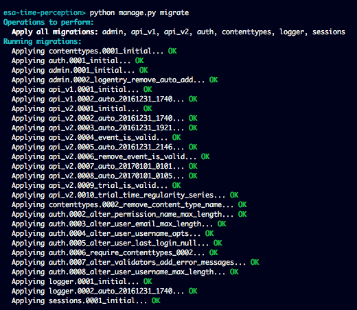

.. _installation:

Installation
============

.. warning:: Application requires Python 3.6 or newer.

.. code-block:: sh

    git clone https://github.com/AstroMatt/esa-time-perception.git

    cd esa-time-perception

    python3 -m venv virtualenv
    source virtualenv/bin/activate
    pip install -r requirements.txt

    python manage.py migrate
    python manage.py createsuperuser
    python manage.py runserver

    open http://localhost:8000/
    open http://localhost:8000/admin/

    Migrating database schema.

    Creating superuser in database.

    Running development server.

    Generating application documentation.
